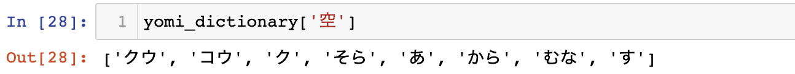

# Building a Special Furigana Machine

In the Japanese language, there are three different forms of written language. Hiragana, Katakana and Kanji. The Kanji characters are a derivation of traditional Chinese characters, and over time they have become a writing system of their own. In Japanese writing, the three forms Hiragana, Katakana and Kanji all mix to express information in newspapers, books and posters. When studying Japanese, it is an initial hurdle for learners to be able to read these Kanji characters, as they have different readings depending on what other characters surround them. To help learners, furigana was invented, as a form to show the reading of the Kanji characters in Hiragana. An example is shown in the image below. 

In this example the furigana/reading of 今日 is きょう:kyou. And the furigana/reading of 天気 is てんき:tennki.
Already in the Japanese Morphological Analysis space, there are many packages that have the ability to convert sentences with Kanji characters into their readings. Some of these packages are MeCab, Jumanji, Pykakashi, and etc. 

However, when it comes to analyzing Japanese text in computational linguistis ways, we run into a problem. In the example above and in all of the furigana packages available so far, there is no way to tell which reading attributes to which character. 

For example, using the example above, 今日 = きょう:kyou, a native Japanese speaker will recognize that...
1. 今:きょ:kyo + 日:う:u
2. 天:てん:ten + 気:き:ki

However, there is no way to tell this with the furigana machines. And on top of this the character 天 has more than one possible reading when alone, the possible readings for 天 are てん, あめ, あま, そら = ten, ame, ama, sora. This is the case for most Kanji characters, most of them have more than one readings and many have up to 4 possible readings. 

In this project I will be creating a special furigana machine that will be able to put these readings on any combination of characters individually. 
For example, using this machine the program will be able to determine that 今日 is 今:きょ:kyo + 日:う:u. This will be useful to implement in Japanese learning textbooks or a new program that will help learners read any text. 

Starting off this project we first need to build a dictionary of all the possible readings of every Kanji character. We will be using the Mojikiban Database (mji.00601.csv), this database is a downloadable dataset with its main use in keyboard language conversion. This dataset helps people type japanese characters in, and is constantly being updated with the newest characters that are being used at the time. However, this dataset is very large and has alot of data that we do not need. I have cleaned the Mojikiban dataset to create a Yomi(character reading) dictionary by running the script yomi_dictionary_create.ipynb. This script creates the output yomi_dictionary_no_okurigana.pkl which allows us to save the dictionary and load it into other scripts. 

[Please have a look at the github repository for this project to download the dictionary and look at the code use to create it.](https://github.com/haruka-takagi-datascience/text_processing)

Here is an example output from the dictionary. The input is the character in question and the output is the list of all possible readings of that character. 

Here is how you would load the dictionary into a new environment. And let's check if the dictionary is properly loaded.

We will use the following packages for the furigana machine; sudachipy, pandas, re, pickle and romkan

We have 3 helper functions for the machine. [To have a look at the full script please check furigana_machine.ipynb on my github repository.](https://github.com/haruka-takagi-datascience/text_processing/blob/main/furigana_machine.ipynb)

1. is_hiragana(text): Function takes in a string of text and returns True if all the characters in the string are hiragana, and false otherwise.
2. sudachi_kana_convert(text): Function that takes in a string of text and returns the katakana reading form of the string. For example, if the text is 道路が閉まっている, the function will return ドウロガシマッテイル.
3. chouon_convert_token_new(kanji_token, katakana_token): Function that takes in the kanji token and the katakana token. And returns a list of furigana for each kanji character in the kanji token as a list of strings. For example, if the kanji_token is 道路 and the katakana_token is ドウロ. The function returns ['どう','ろ'].
Another example, if the kanji_token is 閉まっ and the katakana_token is シマッ. The function returns ['し'].

The main function is furigana_machine. Seen below.

This function takes in text and outputs a string of text with the furigana in brackets.
For example, if the text is 道路が閉まっている then the output is 道路(どうろ)が閉(し)まっている.

Here are some more examples below.

This concludes the furigana machine! Thank you for reading!
